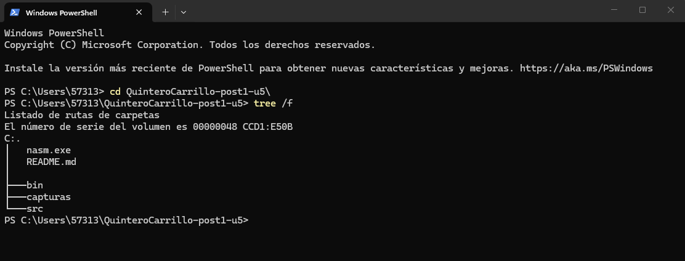
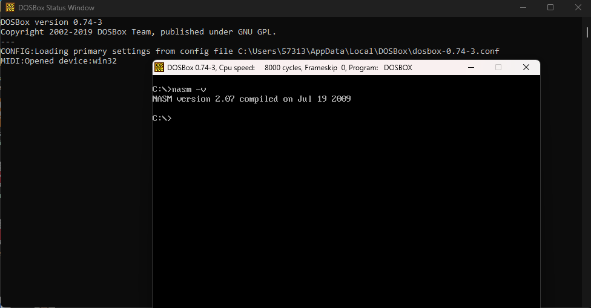
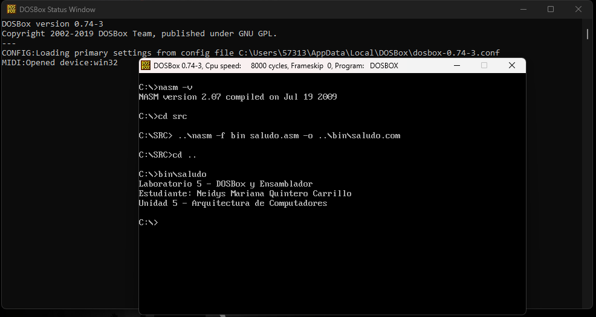
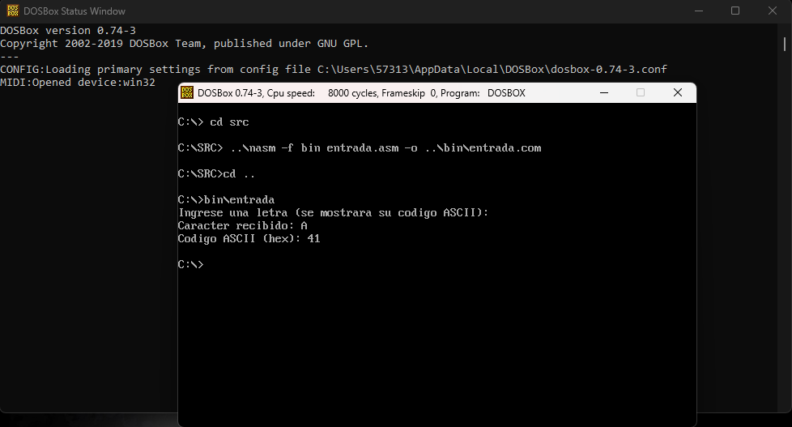
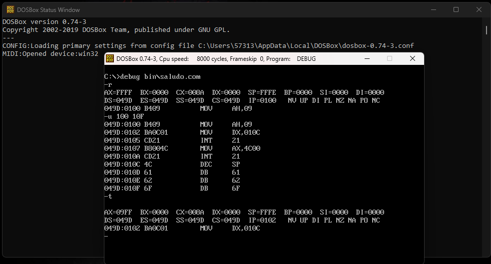
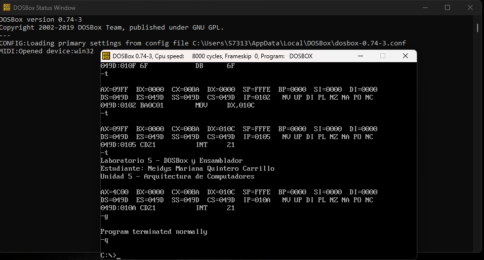

# Laboratorio 5 — DOSBox y Ensamblador x86
**Estudiante:** Neidys Mariana Quintero Carrillo
**Curso:** Arquitectura de Computadores — Ingeniería de Sistemas  
**Universidad:** Francisco de Paula Santander  
**Año:** 2026

## Entorno de trabajo
- SO Anfitrión: Windows 11
- DOSBox: 0.74-3
- NASM: 2.x (para DOS)
- Git: version 2.45.1.windows.1

## Descripción
Este laboratorio consiste en la configuración de un entorno DOSBox funcional
para el desarrollo de programas en lenguaje ensamblador x86. Se escribieron
y ensamblaron dos programas completos con NASM dentro del entorno emulado,
se verificó su comportamiento mediante el depurador DEBUG de DOS, y se
documentó todo el proceso en este repositorio con capturas de pantalla y
commits descriptivos.

---
## Estructura del repositorio
QuinteroCarrillo-post1-u5/
├── src/
│   ├── saludo.asm       # Programa 1: salida de texto con INT 21h
│   └── entrada.asm      # Programa 2: lectura de teclado y eco en hex
├── bin/
│   ├── saludo.com       # Ejecutable compilado del programa 1
│   └── entrada.com      # Ejecutable compilado del programa 2
├── capturas/
│   ├── cp1_estructura.png    # Checkpoint 1: árbol de directorios
│   ├── cp2_dosbox_nasm.png   # Checkpoint 2: DOSBox con nasm -v
│   ├── cp3_saludo.png        # Checkpoint 3: ejecución de saludo.com
│   ├── cp4_entrada.png       # Checkpoint 4: ejecución de entrada.com
│   └── cp5_debug.png         # Checkpoint 5: sesión DEBUG
├── dosbox.conf          # Configuración personalizada de DOSBox
└── README.md            # Este archivo

---

## Pasos realizados

### Paso 1 — Preparación del directorio de trabajo

Se creó la estructura de carpetas `src/`, `bin/` y `capturas/` en el sistema
anfitrión usando PowerShell. Se inicializó el repositorio Git con la rama
principal `main`.

### Paso 2 — Configuración de DOSBox

Se creó el archivo `dosbox.conf` con los parámetros recomendados: 8000 ciclos
de CPU, 16 MB de memoria y escala 2x. La sección `[autoexec]` monta
automáticamente el directorio del proyecto como unidad `C:\` al iniciar DOSBox.

Se copió `nasm.exe` y `CWSDPMI.EXE` al directorio raíz del proyecto para
que fueran accesibles desde DOSBox. La instalación se verificó con `nasm -v`
que mostró la versión 2.07.

### Paso 3 — Programa 1: salida de texto con INT 21h

Se escribió `src/saludo.asm` usando la interrupción DOS `INT 21h` función
`09h` para imprimir tres líneas de texto terminadas en `$`. El programa
se ensamblò con NASM en formato `.COM`:
..\nasm -f bin saludo.asm -o ..\bin\saludo.com

La ejecución mostró correctamente las tres líneas con los datos del estudiante.

### Paso 4 — Programa 2: entrada de teclado y eco

Se escribió `src/entrada.asm` usando `INT 21h` función `07h` para leer un
carácter del teclado sin eco automático, y función `02h` para mostrarlo.
Se implementó una subrutina `print_hex_nibble` que convierte el código ASCII
del carácter a su representación hexadecimal separando nibbles alto y bajo.
..\nasm -f bin entrada.asm -o ..\bin\entrada.com

### Paso 5 — Verificación con DEBUG

Se utilizó el depurador DEBUG de DOS para cargar `saludo.com` y analizar
su ejecución a nivel de instrucción. Se usaron los comandos:

- `-r` para ver el estado inicial de los registros
- `-u 100 10F` para desensamblar las instrucciones del programa
- `-t` para ejecutar paso a paso y observar cambios en AX y DX
- `-g` para ejecutar hasta el final
- `-q` para salir del depurador

Se observó cómo `MOV AH, 09h` carga la función en el registro AH,
y `MOV DX, nombre` apunta DX a la dirección de la cadena en memoria
antes de llamar a `INT 21h`.

---

## Conclusiones

- La emulación con DOSBox permite recrear un entorno DOS completo sobre
  Windows moderno, lo que facilita el aprendizaje de ensamblador x86 sin
  necesidad de hardware antiguo.
- El uso de interrupciones DOS (INT 21h) demuestra cómo los programas
  interactúan con el sistema operativo a través de una interfaz de bajo
  nivel, cargando parámetros en registros antes de invocar la interrupción.
- El depurador DEBUG permite verificar el comportamiento real del procesador
  instrucción por instrucción, confirmando los cambios en los registros AX
  y DX durante la ejecución.

---
